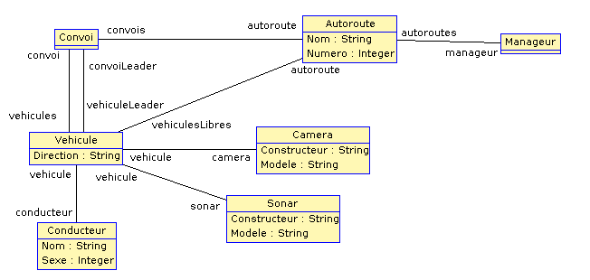

[Retour au laboratoire 1](../TP1/)

# Diagrammes de classe

Cette section présente un diagramme de 
classes de notre laboratoire.

## Explication

1. Une classe `Manageur` nous permet d'instancier des systèmes de gestion de convoi et donc de simuler de multipler expériences de recherche.

2. Une classe `Autoroute` nous permet d'instancier des voies de circulations à double sens pouvant contenir des convois ou bien des véhicules libres :
   - Une autoroute peut être vide (aucun véhicule ni convoi)
   - Une autoroute comporte deux destinations (`A` et `B`)

3. Une classe `Convoi` nous permet d'instancier des groupes automatise de véhicules autonomes ou non :
   - Un convoi comporte au minimum un véhicule leader.
   - Un convoi ne peut comporter que des véhicules allant dans la même direction
   - Un convoi doit comporter au moins un conducteur dans sa liste de véhicules
