[Retour au laboratoire 1](../TP1/)

# Invariants

## VehiculeAUnConducteurOuUnCapteur:

##### Explication

Cet invariant permet de vérifier que chaque véhicule a un conducteur ou bien un capteur (radar, camera, etc..) au minimum.

La logique est assez simple à comprendre puisqu'elle consiste en plusieurs **or** en série demandant d'avoir un conducteur, un sonar ou une caméra.
 
```
-- VehiculeAUnConducteurOuUnCapteur:
-- Un vehicule doit avoir un conducteur ou bien au moins un capteur (radar, camera, etc..).
 
context i:Vehicule
    inv VehiculeAUnConducteurOuUnCapteur:
       i.conducteur->notEmpty
       or i.sonar->notEmpty
       or i.camera->notEmpty
```

##### Preuve d'indépendance

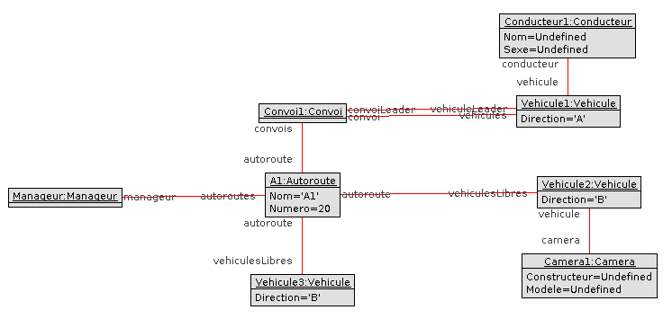

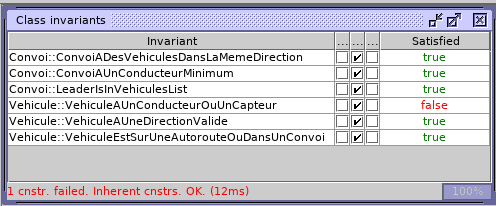


## ConvoiAUnConducteurMinimum

##### Explication

Cet invariant permet de vérifier que chaque convoi dispose d'au minimum **un** conducteur, peu importe sa position dans le convoi.

Au niveau de la logique il suffit de verifier qu'il existe au moins un conducteur dans la liste de vehicule du convoi ou dans le vehicule leader.

```
-- ConvoiAUnConducteurMinimum:
-- Un convoi doit avoir au moins un conducteur dans les vehicules du convoi.
 
context i:Convoi
    inv ConvoiAUnConducteurMinimum:
        i.vehicules->exists(e|e.conducteur->notEmpty)
        or i.vehiculeLeader.conducteur->notEmpty

```

##### Preuve d'indépendance

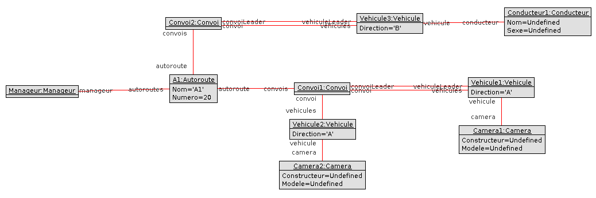


## LeaderIsInVehiculesList

##### Explication

Cet invariant permet de vérifier que le vehicule leader de chaque convoi est **aussi** present dans la liste des vehicules en faisant parties.

```
-- LeaderIsInVehiculesList:
-- Le leader doit etre present dans la liste de vehicule.
 
context i:Convoi
    inv LeaderIsInVehiculesList:
        i.vehicules->select(v|v = i.vehiculeLeader)->notEmpty
```

##### Preuve d'indépendance

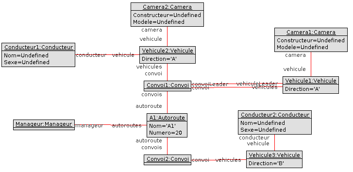

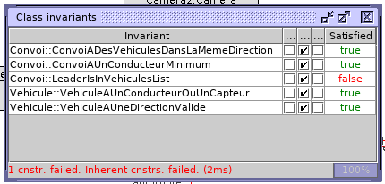

## ConvoiADesVehiculesDansLaMemeDirection

##### Explication

Cet invariant permet de vérifier que les convois ne comportent **QUE** des vehicules allant dans la meme direction.


```
-- ConvoiADesVehiculesDansLaMemeDirection:
-- Un convoi ne contient que des vehicules allant dans la meme direction.
 
context i:Convoi
    inv ConvoiADesVehiculesDansLaMemeDirection:
        i.vehicules.Direction->flatten()->asSet()->size() = 1
```

##### Preuve d'indépendance

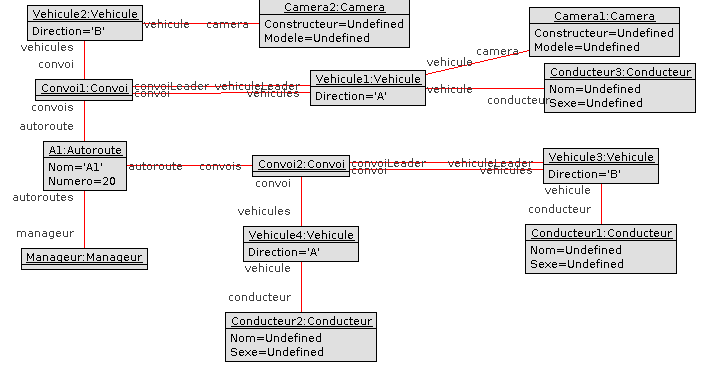

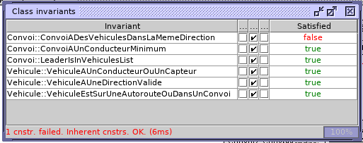


## VehiculeAUneDirectionValide

##### Explication

Cet invariant permet de verifier que tout les vehicules ont une direction et que cette derniere est valide (il n'existe que deux sens sur une autoroute).

```
-- VehiculeAUneDirectionValide:
-- Un vehicule a toujours une direction valide.
 
context i:Vehicule
    inv VehiculeAUneDirectionValide:
        Set {i.Direction}->intersection(Set {'A','B'})->notEmpty
```

##### Preuve d'indépendance

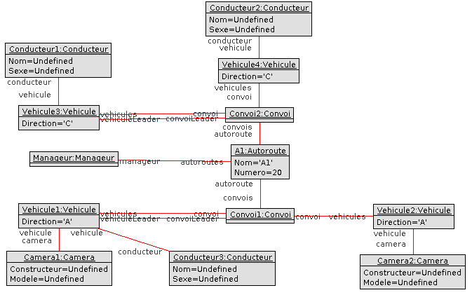

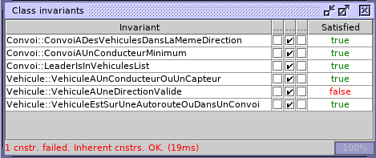


## VehiculeEstSurUneAutorouteOuDansUnConvoi

##### Explication

Cet invariant permet de verifier que tout les vehicules sont soit sur une autoroute soit dans un convoi, mais pas les deux en meme temps.

```
-- VehiculeEstSurUneAutorouteOuDansUnConvoi:
-- Un vehicule est soit dans un convoi soit sur une autoroute mais pas les deux
 
context i:Vehicule
    inv VehiculeEstSurUneAutorouteOuDansUnConvoi:
        if i.autoroute->notEmpty
        then i.convoi = Undefined
        else i.convoi->notEmpty
        endif
```

##### Preuve d'indépendance

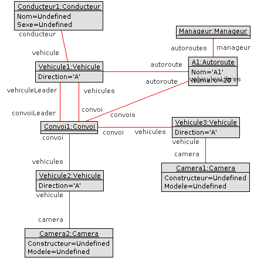

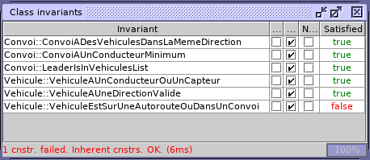
