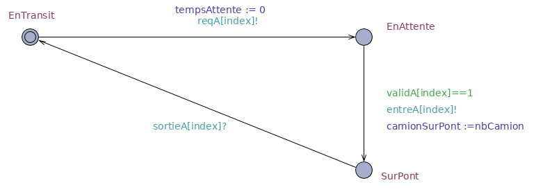
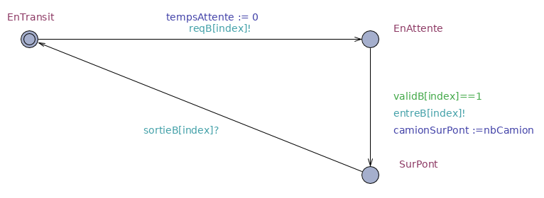
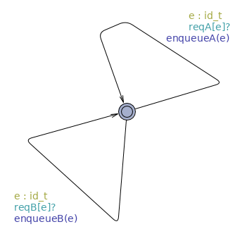
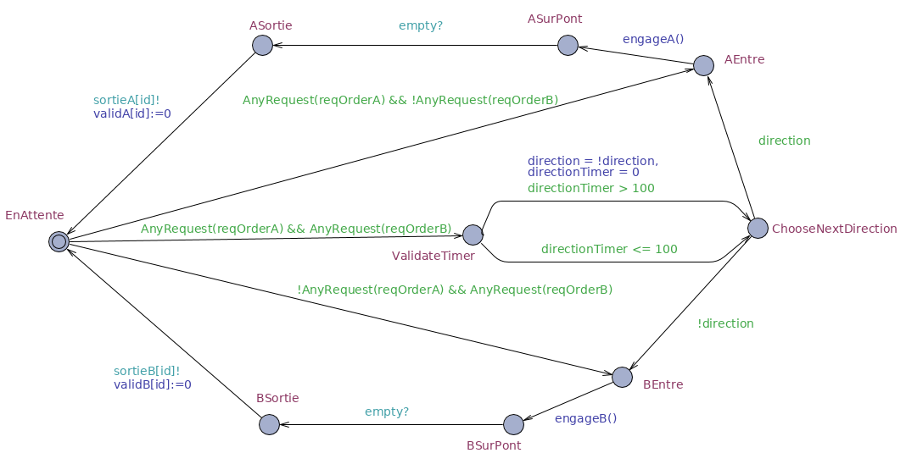
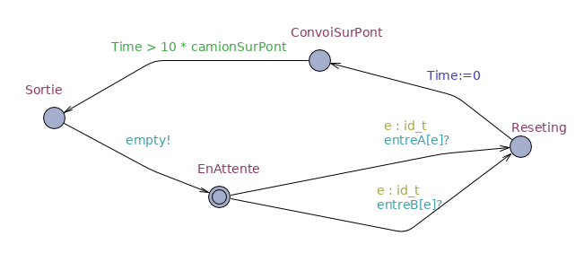

[Retour au laboratoire 2](../TP2/)

# Modelisation

## Modelisation des convois

Nous avons deux templates différents pour les convois, soit un pour chaque direction du pont (ie: A et B).

Ces deux templates sont très similaires et ne changent que par leurs noms de variables, aucune logique ne diffère entre l'un et l'autre.




##### État du modelé

Pour des raisons de simplification du modelé, nos convois ne disposent que de 3 états :

 - EnTransit : Le convoi est en chemin vers le pont
 - EnAttente : Le convoi attend de pouvoir passer sur le pont
 - SurPont : Le convoi traverse sur le pont
 
Chaque convoi qui fini une traverse du pont ce met instantanément en transit vers ce même pont, toujours dans la même direction (imaginons une grande boucle passant par un autre pont) et relance une requête pour simuler plus de trafic.

##### Transition : EnTransit -> EnAttente

Le convoi effectue ce changement d'état en :
 - Initialisant une horloge système "tempsAttente" nous permettant de voir le temps que celui-ci attend pour passer sur le pont.
 - En envoyant une requête de passage sur un canal de communication avec le gestionnaire de requête.
 
##### Transition : EnAttente -> SurPont

Le convoi effectue ce changement d'état en :
 - Verifiant dont il a bien reçu une "validation" de passage
 - En mettant à jour une variable globale du nombre de camion sur le pont
 - En informant de son engagement sur le pont sur un canal de communication.

##### Transition : SurPont -> EnTransit

Le convoi effectue ce changement d'état en :
 - Recevant un message disant que le convoi a fini sa traverse et ne gêne plus la circulation.


## Modelisation du gestionnaire de requête

Notre système dispose d'un gestionnaire de requête en charge de l'enregistrement et du classement des requêtes de passage sur le pont.



Ce système est assez simple puisqu'il ne fait que recevoir des requêtes des convois en direction de A ou B et les ajouter dans une liste ordonnée.

```
// Ajoute un nouveau convoi fourni en argument dans le tampon de requête A
void enqueueA(int element)
{
       reqOrderA[reqOrderALen++] = element;
}

// Ajoute un nouveau convoi fourni en argument dans le tampon de requête B
void enqueueB(int element)
{
       reqOrderB[reqOrderBLen++] = element;
}
```


## Modelisation du contrôleur de pont

Le contrôleur de pont est en charge d'accepter les requêtes de passage recu de manière à dispatcher le droit de passage aux différents convois en attente.



Bien que ce soit notre template le plus complexe, celui-ci est en vérité assez simple et ce lis en symétrise.

1. Le contrôleur vérifie s’il y a des requêtes d'une ou plusieurs directions:
   - S’il n'y a qu'une direction ayant fait une requête, il laisse passer le prochain convoi de cette direction.
   - S’il y a deux directions ayant fait des requêtes il laisse passer la direction ayant le plus attendu jusqu'a maintenant.
    
    ```
    // regarde s’il existe au moins un request dans un tableau de requête offert en argument
    bool AnyRequest(int array[N])
    {
        int i = 0;
            while (i < N)
            {
            if(array[i] != 0)
            {
                return true;
            }
            i++;
        }
        return false;
    }

    ```
2. Une fois le convoi choisi, il engage un véhicule sur le pont 
    
    ```
    // Engage le premier convoi du tampon A sur le pont (utilise dequeueA())
    void engageA()
    {
    	id = dequeueA();
        validA[id] = 1;	
        if(!direction)
        {
            direction = true;
            directionTimer = 0;
        }
    }
    
    // Supprime la première requête du tampon(buffer) de requête A
    int dequeueA()
    {
        int value = reqOrderA[0];
    
            int i = 0;
            reqOrderALen -= 1;
            while (i < reqOrderALen)
            {
                    reqOrderA[i] = reqOrderA[i + 1];
                    i++;
            }
            reqOrderA[i] = 0;
    
        return value;
    }
    ```
3. Lorsque le pont est vide, il indique au convoi que son passage est officiellement terminé et il révoque son droit de passage actuel.
4. Le contrôleur se met en attente de requête ou recommence son traitement.

## Modelisation du pont

Le template de pont représente le pont en lui même et permet de gérer l'utilisation de la ressource (est-ce que le pont est déjà occupé par un convoi ou non).



Le pont dispose d'une logique assez simple :

1. Le pont est initialement en attente (il est libre).
2. Lorsqu'un convoi s'engage sur le pont une horloge est initialisée.
3. Le pont attend un temps défini par le nombre de camions du convoi en cours de passage avant de revenir en attente.
4. Le pont indique qu'il est de nouveau libre. 
 
