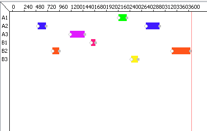

[Retour au laboratoire 2](../TP2/)

# Verification

## Gantt

Voici notre diagramme de gantt representant les droits de passage actifs pour chaque convois.


```
gantt {
 A1: validA[0] == 1 -&gt; 1;
 A2: validA[1] == 1 -&gt; 2;
 A3: validA[2] == 1 -&gt; 3;
 B1: validB[0] == 1 -&gt; 4;
 B2: validB[1] == 1 -&gt; 5;
 B3: validB[2] == 1 -&gt; 6;
}
```
## P1 : Il n’y a pas de « deadlock »

On versifie qu'il n'y ait pas de deadlock, c'est-à-dire qu'il n'existe aucun cas possible ou le système se retrouve dans un état bloquant sans étape suivante.

Cette vérification permet de valider par la même occasion qu'il n'y a pas de boucle sans fin, sans quoi la génération des cas possibles ne sera pas possible par le système.

```
A[] not deadlock
```

## P2 : Il n’y a pas de collision (i.e. deux convois circulants en sens inverse) sur le pont.

On vérifie que s’il y a un convoi dans un sens sur le pont, il est impossible d'avoir un convoi dans l'autre sens sur ce même pont. On effectue cette vérification sur l'ensemble des cas possibles de notre système.

```
A[] (DirectionA1.SurPont || DirectionA2.SurPont || DirectionA3.SurPont) imply not (DirectionB1.SurPont || DirectionB2.SurPont || DirectionB3.SurPont)
```

## P3 : Le pont est juste et équitable (= « fair »).

Pour valider que le système est équitable, on valide le fait que si un convoi de la direction A passe, alors un convoi de la direction B va passer dans le futur. (les requêtes sont infinies, donc on valide le fait qu'elle sera acceptée)

**erreur**: Ce vérifieur ne fonctionne malheureusement pas.

```
DirectionA1.SurPont --> DirectionB1 --> SurPont
```

## P4 : Un convoi qui arrive est certain de passer sur le pont à l’issue d’une durée bornée.

On valide que chaque convoi en attente ne l'est pas depuis plus longtemps que le temps maximum défini dans notre constante.

**erreur**: Ce vérifieur ne fonctionne malheureusement pas. Nous avons un deadlock si nous mettons l'invariant dans les templates CAA et CBB. Cependant ce vérifieur fonctionne si nous mettons l'invariant, et ce malgré le deadlock.

```
A[] not ((DirectionA1.EnAttente and DirectionA1.tempsAttente > TEMPSATTENTEMAX) || (DirectionB1.EnAttente and DirectionB1.tempsAttente > TEMPSATTENTEMAX))
```

## P5 : Lorsqu'un convoi entre sur le pont, il en ressort.

Nous vérifions que si un convoi entre sur le pont il en ressort. Cette vérification est importante puisque nous complexifie le modèle sur cette partie en admettant le pont comme une ressource qui se libère elle même.

```
Pont.ConvoiSurPont --> Pont.Sortie
```

