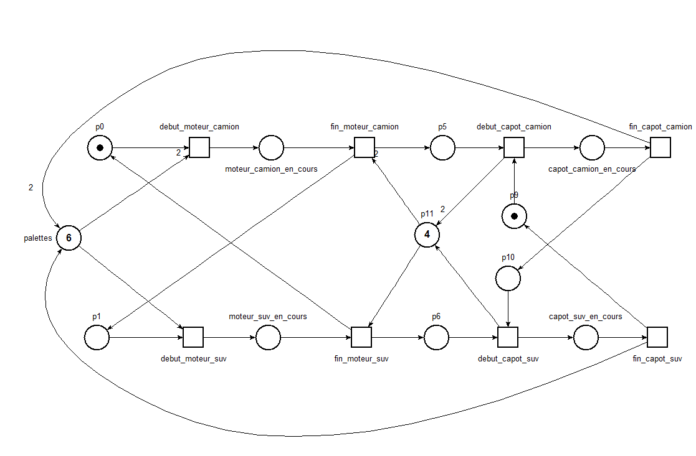

[Retour au laboratoire 3](../TP3/)

# Verification Structurelle

## Presentation general

Pour l'analyse des invariants, nous avons du utiliser tina au lieu de  PIPE. Pour ce faire nous avon recree le reseau suivant:



## Comportementale

```
# Created Tue Apr 10 15:13:46 2018 by TINA version 3.4.4

kts petri_tina
27 nodes
46 edges
1 state property namespace(s)
  S: 12 properties: capot_camion_en_cours capot_suv_en_cours moteur_camion_en_cours ...
1 transition property namespace(s)
  E: 8 properties: debut_capot_camion debut_capot_suv debut_moteur_camion ...
27 state property sets
  27 over namespace S
8 transition property sets
  8 over namespace E

state 0
props p0 p11*4 p9 palettes*6
trans debut_moteur_camion/1

state 1
props moteur_camion_en_cours p11*4 p9 palettes*4
trans fin_moteur_camion/2

state 2
props p1 p11*2 p5 p9 palettes*4
trans debut_capot_camion/3 debut_moteur_suv/4

state 3
props capot_camion_en_cours p1 p11*4 palettes*4
trans debut_moteur_suv/5 fin_capot_camion/6

state 4
props moteur_suv_en_cours p11*2 p5 p9 palettes*3
trans debut_capot_camion/5 fin_moteur_suv/7

state 5
props capot_camion_en_cours moteur_suv_en_cours p11*4 palettes*3
trans fin_capot_camion/8 fin_moteur_suv/9

state 6
props p1 p10 p11*4 palettes*6
trans debut_moteur_suv/8

state 7
props p0 p11 p5 p6 p9 palettes*3
trans debut_capot_camion/9 debut_moteur_camion/10

state 8
props moteur_suv_en_cours p10 p11*4 palettes*5
trans fin_moteur_suv/11

state 9
props capot_camion_en_cours p0 p11*3 p6 palettes*3
trans fin_capot_camion/11 debut_moteur_camion/12

state 10
props moteur_camion_en_cours p11 p5 p6 p9 palettes
trans debut_capot_camion/12

state 11
props p0 p10 p11*3 p6 palettes*5
trans debut_capot_suv/13 debut_moteur_camion/14

state 12
props capot_camion_en_cours moteur_camion_en_cours p11*3 p6 palettes
trans fin_capot_camion/14 fin_moteur_camion/15

state 13
props capot_suv_en_cours p0 p11*4 palettes*5
trans fin_capot_suv/0 debut_moteur_camion/16

state 14
props moteur_camion_en_cours p10 p11*3 p6 palettes*3
trans debut_capot_suv/16 fin_moteur_camion/17

state 15
props capot_camion_en_cours p1 p11 p5 p6 palettes
trans fin_capot_camion/17 debut_moteur_suv/18

state 16
props capot_suv_en_cours moteur_camion_en_cours p11*4 palettes*3
trans fin_capot_suv/1 fin_moteur_camion/19

state 17
props p1 p10 p11 p5 p6 palettes*3
trans debut_capot_suv/19 debut_moteur_suv/20

state 18
props capot_camion_en_cours moteur_suv_en_cours p11 p5 p6
trans fin_capot_camion/20 fin_moteur_suv/21

state 19
props capot_suv_en_cours p1 p11*2 p5 palettes*3
trans fin_capot_suv/2 debut_moteur_suv/22

state 20
props moteur_suv_en_cours p10 p11 p5 p6 palettes*2
trans debut_capot_suv/22 fin_moteur_suv/23

state 21
props capot_camion_en_cours p0 p5 p6*2
trans fin_capot_camion/23

state 22
props capot_suv_en_cours moteur_suv_en_cours p11*2 p5 palettes*2
trans fin_capot_suv/4 fin_moteur_suv/24

state 23
props p0 p10 p5 p6*2 palettes*2
trans debut_capot_suv/24 debut_moteur_camion/25

state 24
props capot_suv_en_cours p0 p11 p5 p6 palettes*2
trans fin_capot_suv/7 debut_moteur_camion/26

state 25
props moteur_camion_en_cours p10 p5 p6*2
trans debut_capot_suv/26

state 26
props capot_suv_en_cours moteur_camion_en_cours p11 p5 p6
trans fin_capot_suv/10
```


## Structurelle

##### Lanalyse a identifier les T-invariant suivant :
```
tr debut_capot_camion p5 p9 -> capot_camion_en_cours p11*2 
tr debut_capot_suv p10 p6 -> capot_suv_en_cours p11 
tr debut_moteur_camion p0 palettes*2 -> moteur_camion_en_cours 
tr debut_moteur_suv p1 palettes -> moteur_suv_en_cours 
tr fin_capot_camion capot_camion_en_cours -> p10 palettes*2 
tr fin_capot_suv capot_suv_en_cours -> p9 palettes 
tr fin_moteur_camion moteur_camion_en_cours p11*2 -> p1 p5 
tr fin_moteur_suv moteur_suv_en_cours p11 -> p0 p6 
pl p0 (1)
pl p11 (4)
pl p9 (1)
pl palettes (6)
```

##### Lanalyse a identifier les P-invariant suivant :

Il ne peut pas avoir plus de 1 capot de camion ou de suv en construction à un moment donné.
```
capot_camion_en_cours capot_suv_en_cours p10 p9 (1)
```

Il ne peut pas avoir plus de 1 moteur de camion ou de suv en construction à un moment donné.
```
moteur_camion_en_cours moteur_suv_en_cours p0 p1 (1)
```

Il ne peut pas avoir plus de 4 palete pour les camion en atente de recevoir un capot (positioner entre les deux machines)
```
p11 p5*2 p6 (4)
```

Il n'a jamais plus de 6 palettes en utilisation.
```
capot_camion_en_cours*2 capot_suv_en_cours moteur_camion_en_cours*2 moteur_suv_en_cours p5*2 p6 palettes (6)
```

Les prochain invariant combine les jetton d'action et de palette is son donc moin utile.
```
capot_camion_en_cours*3 capot_suv_en_cours moteur_camion_en_cours*3 moteur_suv_en_cours p0 p10 p5*3 palettes (7)
capot_camion_en_cours*2 capot_suv_en_cours*3 moteur_camion_en_cours*2 moteur_suv_en_cours*3 p1*2 p6*3 p9*2 palettes (8)
capot_suv_en_cours*2 moteur_suv_en_cours*2 p1*2 p11 p6*3 p9*2 (6)
capot_camion_en_cours moteur_camion_en_cours p0 p10 p11 p5*3 (5)

```
