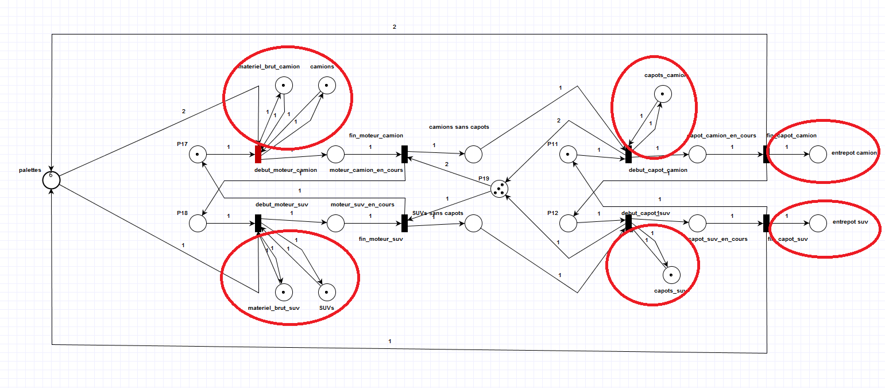
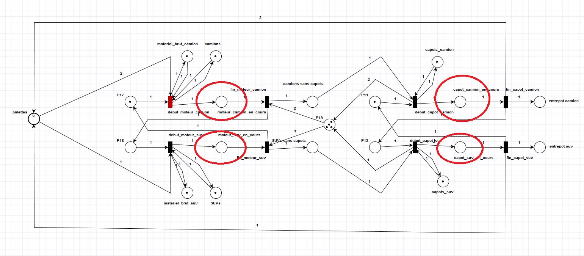

[Retour au laboratoire 3](../TP3/)

# TRANSFORMATION DE BOUSSIN

Voici le resultat optenue apret les transformation de boussin:

Pour arriver a ce resultat nous avons tout dabort suprimer les resouces ilimiter et le stokage.

Par la suite nous avons suprimer les lien suivant a laide des regles 1 et 2 de transformation de boussin. 

