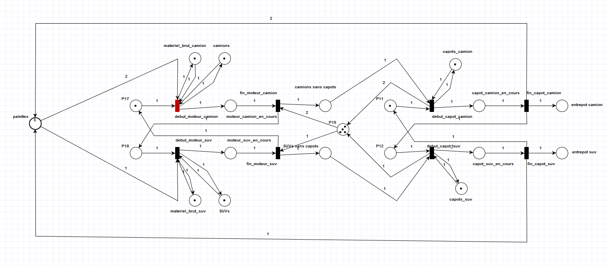
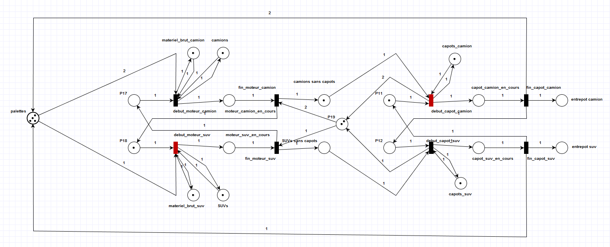
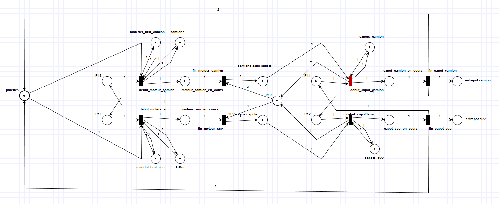
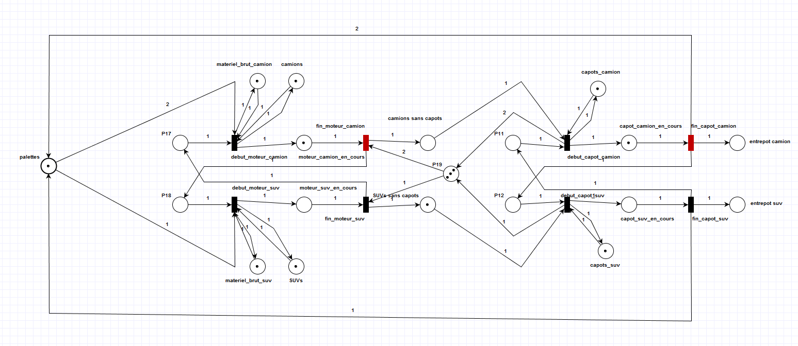
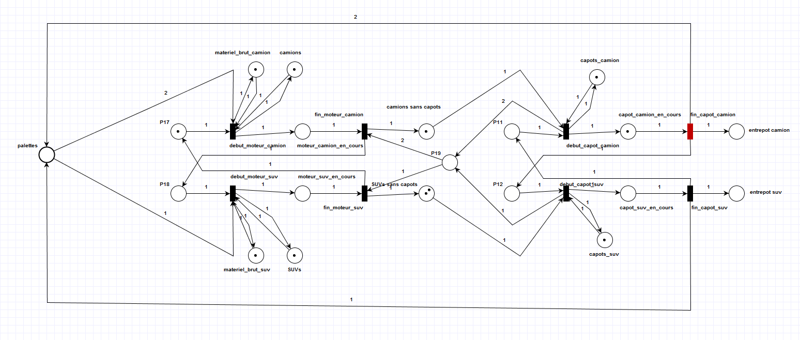
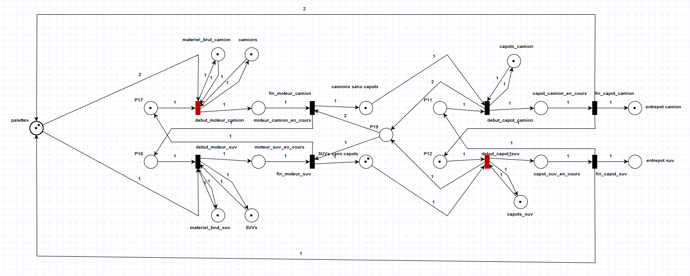

# MODÉLISATION ET SIMULATION

## Presentation general

Voici notre reseau de Petri lors du lancement de la simulation:

Nous y retrouvons:

 - Un stock de palettes (6) sur la gauche
 - Le robot de moteur sur la gauche
    - Il dispose de plusieurs ressources en stock illimite
    - Il ne dispose que d'un seul jeton d'action (ie: il ne peux faire qu'une chose a la fois) 
 - Le robot de ca    - Il dispose de plusieurs ressources en stock illimite
    - Il ne dispose que d'un seul jeton d'action (ie: il ne peux faire qu'une chose a la fois) pot sur la droite 
    - Il dispose de plusieurs ressources en stock illimite
    - Il dispose de SUV et Camion motorises en quantite limite
    - Il ne dispose que d'un seul jeton d'action (ie: il ne peux faire qu'une chose a la fois) 
 - Un stock d'espace libre `P19` (4) entre les deux robots
 
## Modification de l'espace libre entre les deux robots

Comme vous pouvez le constater, la presence d'un camion entre les deux robots occupe deux palettes :

 - Il ne reste que 4 palettes de libre en stock
 - Il ne reste que deux espaces libre entre les deux camions
 
## Manque d'espace libre entre les deux robots

Comme vous pouvez le constater, le moteur de camion en cours 
ne peut pas etre termine car il ne reste qu'une seule place 
entre les deux robots et qu'un camion prend deux espace libre.

## Liberation d'espace libre entre les deux robots

En suivant le meme principe, le moteur de camion en cours qui 
ne pouvais ce terminer a l'etape precedente peut maintenant 
ce terminer puisque deux places libre on ete faite entre les 
deux robots et qu'il n'en manquais qu'une seule.

## Manque de palettes libre en stock

Lorsque la production ce poursuit avec l'etape de 
fabrication des capots il est possible que le nombre de 
palettes necessaires depasse le stock disponible (6).

Comme vous pouvez le voir, le cas echeant, la 
production de moteur est mise en pause faute de 
moyen de transport.

## Liberation de palettes libre dans le stock

Comme vous pouvez le constater, lors de la fin 
de production d'un capot les palettes sont libere 
et remise en stock, permettant ainsi de reprendre 
la production de moteur qui peut etre en 
interruption faute de stock.