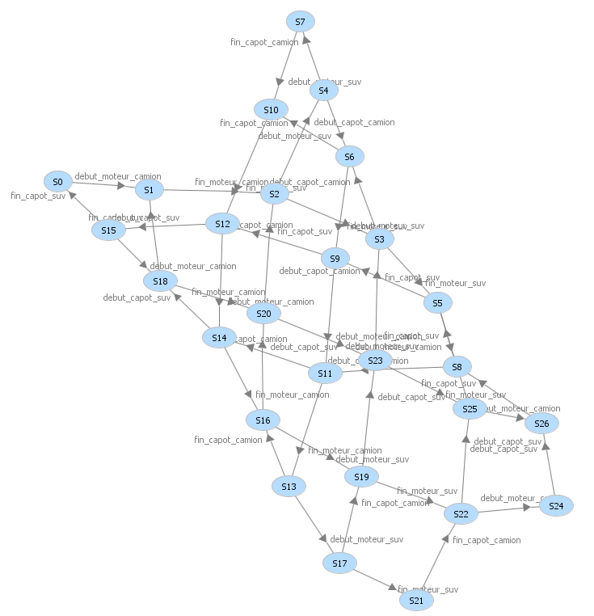

[Retour au laboratoire 3](../TP3/)

# VÉRIFICATION COMPORTEMENTALE

## Graphe d'accessibilite

Le graphe d'accessibilite nous permet de faire certaines affirmations sur notre reseau:

 - Il y a 26 etat possible au total
 - Aucun des etat possible n'est bloquant
 - Il est possibe que le stock de palette libre soit insufisant
 - Il est possible que nous manquions d'espace libre entre les deux robots

Une reflexion sur ce graphe nous permet de 
constater que les deux dernieres consideration 
dependent uniquement de la vitesse de 
fabrication des deux robots, ce dont nous 
n'avons aucune connaissance dans l'enonce.

Nous pourrions cependant utiliser ces deux 
considerations pour ouvrir une discussion avec 
les personnes competentes et voir si l'augmentation 
du stock ou de l'espace augmenterais le rendement 
de l'usine.